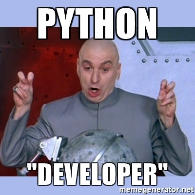
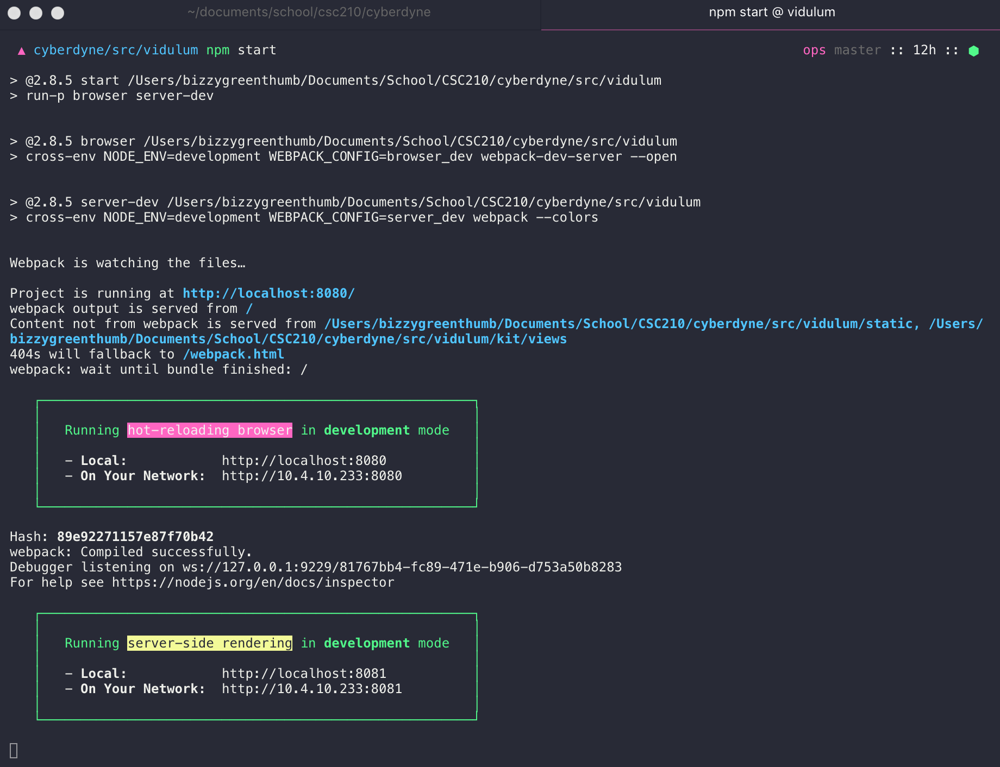

# Cyberdyne

[](https://github.com/nikku/works-on-my-machine)

This is the final project for CSC 210, fall 2017 at the University of Rochester. The group members are: John Bissonette, Fernando Parnes, Mike Pawlicki,
Sharfuz Sifat, and Aaron McClure. We would like to give a special shout-out to [Seedstars Labs][11] as we [adapted their fantastic boilerplate][10] for
scaffolding out this project.

## Meaning of the Name

Cyberdyne, or Cyberdyne Systems, is the company that was contracted by the United States Armed Forces to construct **Skynet**, a networked intelligence that
was meant to eliminate any human-errors in the decision loop to employ the military's arsenal, including its nuclear weapons. We all know how this turned out...

## How to Setup

Begin by forking the repo to have your own copy. Since the `master` repo is private, yours is as well. Clone to your machine, and commit your changes locally
then push to your repo's remote. Once changes have been reviewed and approved by the team, we can submit PRs to the project repo and pull your changes into
this master, which will act as the central repository for tracking as well as the "single source of truth" for the current working state of the application.

### Pre-Requisites

There are several pre-requisites that need to be established:

- [Python][7] >= 3.6.0
- [virualenvwrapper][4] (or [virtualenvwrapper-win][6] if using Windows). This is used to create "virtual environments" for Python, which installs a local version
of the Python executable, and then installs all packages used by that environment locally, so that there are no conflicts with system-wide package installations.
- [PostgreSQL][5]
- An IDE such as PyCharm, or if you'd like to use a text editor that's fine, just make sure that you let me know what you're using so I can make sure that the
`.gitignore` file has the appropriate items ignored so our repository doesn't get polluted with unnecessary files. If you're using a text editor, I'd personally
suggest using [Visual Studio Code][2]. I can provide a list of extensions that will be useful if you choose to use VS Code.
- [Node.js][12]: a server-side run-time environment for executing JavaScript outside of the browser. Node is what enables us to use JavaScript as a "real"
programming language, leveraging APIs to interact with the file system and perform operations that normally would be restricted within the browser sandbox. We
use **Node.js version 8.2.1**
- [nvm][13]: a library that enbales using specific versions of Node.js on a per-project basis. Consider this conceptually similar to `virtualenvwrapper`, with
the caveat that nvm does not create virtual environments for Node. It simply will activate the version of Node defined in the project's `.nvmrc` file. This
helps us by ensuring that everyone has the "correct" version of Node.js that is targeted for the project. In this case, we are targeting Node.js version 8.2.1.
- [Yarn][3]. This is a better package manager for Node.js than npm, and is the suggested frontend package manager for use. It is entirely possible, however, to
use npm alongside Yarn or in place of it.

After installation and initial setup of the pre-requisites is completed, there are the required packages/libraries needed for development. Most of the Python
packages will be listed in the project's `/requirements` directory, and can be installed using `pip`. Frontend dependencies will be managed by Yarn.

### Install Package Dependencies - Python

Using your terminal, command prompt, or however you choose to interact with the command line, `cd` to the project root folder. From this directory, ensure that
you also have **activated** the virtualenv that you've created in order to install Python dependencies locally to that environment:

```bash
workon %ENV_NAME%
```

Once you've ensured this, enter the following command:

```bash
pip install -r requirements/dev.txt
```

**Note:** you'll know if you're in the project root folder if you type `ls` (`dir` in Windows command prompt) and see the file `requirements.txt` located in this
directory. This file begins the chain of installing dependencies for Python, including Django, Django REST Framework, MkDocs, etc.

### Install Package Dependencies - NPM/Yarn

Afterwards, to install the frontend dependencies, navigate in your terminal from the project root directory to the `src/vidulum` directory, which is where all the
frontend client code is located, and you should see a file `package.json`. This contains all the Node.js-related frontend package dependencies. Enter the command:

```bash
yarn install
```

and all the packages will download into the `src/vidulum/node_modules` folder.

### Run Database Migrations, Create Superuser, and Load Fixtures

The last step before running the project and ensuring that everything is setup is to migrate the database and then create a superuser account. Django has a
facility to automatically track changes to the model classes in the installed applications, and from these changes create proper database migrations to keep the
database schema in order and prevent some vexing problems. From the project source folder, probably something like `cyberdyne/src`, run the command
`python manage.py migrate`. This will use the database connection defined in the `local.env` environment variables file and create the database schema and apply
all changes defined in the migration files. If this runs successfully, you should see something like this in your terminal:

![Successful database migration][8]

The next step, is to create a superuser account for *this particular instance*, meaning that everytime the project is cloned, the superuser account will need
to be created again. Simply enter the command `python manage.py createsuperuser` and follow the prompts. Last, load the fixtures for the database by running the
command `python manage.py loaddata fixtures.json`.

### Run the Django Server

We're all set! Enter the command `python manage.py runserver` and, if there are no errors present, the terminal should display this:

![createsuperuser and runserver][9]

### Run the Koa2 Frontend Development Server

While working on the frontend portion (client application) we will be making use of a Koa2 server written in JavaScript targeted at the Node.js environment. This
is only while we work on the frontend application, once we are ready to build for production the generated bundle will be served by [nginx][12] or [Apache][13].
Run the following command from `cyberdyne/src/vidulum`:

```bash
npm start
```

and you should see the Webpack build stats along with the following success message:



## Updated Installation Instructions (will be refactored shortly)

We build on the shoulders of giants with the following technologies:

### ReactQL

The following is direct from the README of the ReactQL/kit repository. An amazing project.

#### Stack

- [ReactQL CLI](https://github.com/reactql/cli) for quickly starting a new project (or upgrading an existing one)
- New in 2.x: [React v16](https://facebook.github.io/react/) for UI
- New in 2.x: [Apollo Server](http://dev.apollodata.com/tools/) for enabling the built-in GraphQL server
- [Apollo Client (React)](http://dev.apollodata.com/react/) for connecting to GraphQL
- [React Router 4](https://github.com/ReactTraining/react-router/tree/v4) for declarative browser + server routes
- [Redux](http://redux.js.org/) for flux/store state management

#### GraphQL

- New in 2.x: Built-in GraphQL server via - just pass in your schema, and enable `/graphql` with a single line of code
- [GraphiQL](https://github.com/graphql/graphiql) query browser enabled by default
- Isomorphic GraphQL client - await data via SSR before rendering HTML; query asynchronously in the browser
- Avoid network overhead with local GraphQL querying via [apollo-local-query](https://github.com/af/apollo-local-query)
- Write `.gql` GraphQL query files, use fragments, or type queries inline.

#### Server-side rendering

- Built-in [Koa 2](http://koajs.com/) web server, with async/await routing
- React v16 with streaming API - time-to-first-byte as low as 4-5ms!
- Full route-aware [server-side rendering (SSR)](https://reactql.org/docs/ssr) of initial HTML
- Universal building - both browser + Node.js web server compile down to static files
- Per-request Redux stores. Store state is dehydrated via SSR, and rehydrated automatically on the client
- HTTP header hardening with [Helmet for Koa](https://github.com/venables/koa-helmet)
- Declarative/dynamic `<head>` section, using [react-helmet](https://github.com/nfl/react-helmet)
- Full page React via built-in `<Html>` component - every byte of your HTML is React!
- Run plain HTTP and SSL from the same port - just `config.enableSSL(sslOptions)` in your app code

#### Real-time

- [Hot code reloading](http://gaearon.github.io/react-hot-loader/); zero refresh, real-time updates in development
- React + Redux state preservation on hot reloading, to avoid interrupting your dev flow
- [Development web server](https://reactql.org/docs/setup#development) that automatically rebuilds and restarts on code changes, for on-the-fly SSR testing with full source maps

#### Code optimisation

- [Webpack v3](https://webpack.js.org/), with [tree shaking](https://webpack.js.org/guides/tree-shaking/) -- dead code paths are automatically eliminated
- Separate local + vendor bundles, for better browser caching/faster builds
- Dynamic polyfills, courtesy of [babel-preset-env](https://github.com/babel/babel-preset-env)
- Aggressive code minification with [Uglify](https://webpack.github.io/docs/list-of-plugins.html#uglifyjsplugin)
- [GIF/JPEG/PNG/SVG crunching](https://github.com/tcoopman/image-webpack-loader) for images in production
- CSS code is combined, minified and optimised automatically - even if you use SASS, LESS and CSS together!

#### Styles

- [PostCSS v6](http://postcss.org/) with [next-gen CSS](http://cssnext.io/) and inline [@imports](https://github.com/postcss/postcss-import)
- [SASS](http://sass-lang.com) and [LESS](http://lesscss.org/) support (also parsed through PostCSS)
- Automatic vendor prefixing - write modern CSS, and let the compiler take care of browser compatibility
- Mix and match SASS, LESS and regular CSS - without conflicts!
- CSS modules - your classes are hashed automatically, to avoid namespace conflicts
- Compatible with Foundation, Bootstrap, Material and more. Simply configure via a `.global.*` import to preserve class names

#### Highly configurable

- New in 2.x: Userland configuration.  No need to edit kit code; simply use the built-in `Config` singleton
- Add a GraphQL server with one line of code
- Add GET|POST|PUT|PATCH|DELETE routes - auto-injected with Koa context and the per-request Redux store
- Add a custom 404 handler
- Enable/disable POST body parsing, along with custom options

#### Production-ready

- [Production bundling](https://reactql.org/docs/bundling/production), that generates optimised server and client code
- [Static bundling mode](https://reactql.org/docs/bundling/static) for hosting your full app on any static host -- Github pages, S3, Netlify, etc
- [Static compression](https://webpack.js.org/plugins/compression-webpack-plugin/) using the [Zopfli Gzip](https://en.wikipedia.org/wiki/Zopfli) and [Brotli](https://opensource.googleblog.com/2015/09/introducing-brotli-new-compression.html) algorithms for the serving of static assets as pre-compressed `.gz` and `.br` files (default `vendor.js.bz` goes from 380kb -> 89kb!)
- Easily extendable [webpack-config](https://fitbit.github.io/webpack-config/) files, for modular Webpack tweaks
- [Docker](https://www.docker.com/) support, with an optimised `Dockerfile` out-the-box

#### Developer support

- [ESLint v3](http://eslint.org/)ing based on a tweaked [Airbnb style guide](https://github.com/airbnb/javascript)
- [Jest](https://facebook.github.io/jest/) test runner
- [Node Inspector](https://nodejs.org/en/docs/inspector/) support for SSR in dev mode - remotely debug the server, set breakpoints, inspect the stack from within Chrome
- Tons of code commentary to fill you in on what's happening under the hood
- Extensive, up-to-date [online documentation](https://reactql.org/docs/)
- [Examples repository](https://github.com/reactql/examples), with real-world use cases


### Backend

* [Django](https://www.djangoproject.com/)
* [Django REST framework](http://www.django-rest-framework.org/) Django REST framework is a powerful and flexible toolkit for building Web APIs
* [Django REST Knox](https://github.com/James1345/django-rest-knox) Token based authentication for API endpoints
* [WhiteNoise](http://whitenoise.evans.io/en/latest/django.html) to serve files efficiently from Django
* [Prospector](http://prospector.landscape.io/en/master/) a complete Python static analysis tool
* [Bandit](https://github.com/openstack/bandit) a security linter from OpenStack Security
* [pytest](http://pytest.org/latest/) a mature full-featured Python testing tool
* [Mock](http://www.voidspace.org.uk/python/mock/) mocking and testing Library
* [Responses](https://github.com/getsentry/responses) a utility for mocking out the Python Requests library


### Running Docker (This is not finalized yet)

We can use Docker as a development environment.

* Install [Docker](https://www.docker.com/products/overview) and [Docker Compose](https://docs.docker.com/compose/install/).
* `$ docker-compose build`
* `$ docker-compose up`

To stop the development server:

* `$ docker-compose stop`

Stop Docker development server and remove containers, networks, volumes, and images created by up.

* `$ docker-compose down`

You can access shell in a container

* `$ docker ps  # get the name from the list of running containers`
* `$ docker exec -i -t djangoreactreduxbase_frontend_1 /bin/bash`

The database can be accessed @localhost:5433

* `$ psql -h localhost -p 5433 -U djangoreactredux djangoreactredux_dev`


[1]: https://en.wikipedia.org/wiki/Morax_(demon)
[2]: https://code.visualstudio.com/
[3]: https://yarnpkg.com/en/
[4]: https://virtualenvwrapper.readthedocs.io/en/latest/
[5]: https://www.postgresql.org/
[6]: https://pypi.python.org/pypi/virtualenvwrapper-win
[7]: https://www.python.org/
[8]: docs/migrations.png
[9]: docs/runserver.png
[10]: https://github.com/Seedstars/django-react-redux-base
[11]: https://www.seedstars.com/
[12]: https://nodejs.org
[13]: https://github.com/creationix/nvm
